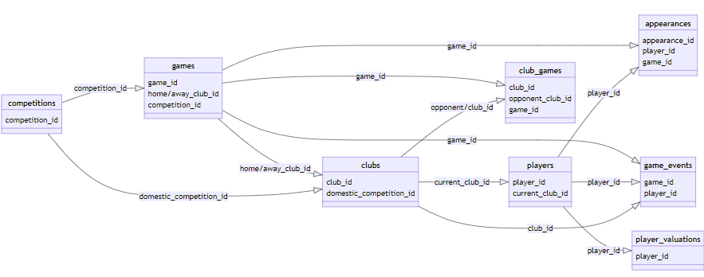

# Football-Data-Analytics
Interactive Dashboard for Football Kaggle dataset from Transfermarkt.

## Data is extracted from Kaggle
 - https://www.kaggle.com/datasets/davidcariboo/player-scores

What does it contain?
The dataset is composed of multiple CSV files with information on competitions, games, clubs, players and appearances that is automatically updated once a week. Each file contains the attributes of the entity and the IDs that can be used to join them together.

### What's case about? (Problem describtion)
- providing analytics and statistics on all players during the tournaments, along with comprehensive statistics on European players' performance. This includes analyzing their goals, assists, and other relevant metrics. By examining the data, managers can gain insights into the performance of European players and make informed decisions when scouting for talent to join the top five leagues, such as the Premier League.


### Technology Stack

- **Terraform** (Infrastructure as Code)
    - **Deployment**: Used to deploy all the needed resources on GCP.

- **Docker**
    - **Containerization**: running a docker compose up command to run in container.

- **Google Cloud Platform** (GCP)
    - **Google Cloud Storage (Datalake)**: Where data lands from the bash script that we run on Google Cloud VM
        [text](download_from_kaggle_to_gcs.sh)
    - **BigQuery (Datawarehouse)**: Where data is stored in dimensional modeling.

- **Mage**
    - **Orchestration Tool**: Used for our data pipeline flow.

- **DBT** (Data Build Tool)
    - **Reporting Layer**: Built in models.


### Data Pipeline Flow


As shown in image our data flow consists of below section:

**1. Data Ingestion**:
- Landing the raw data which fetched using Kaggle API token into google cloud storage into 9 csv format files using the download from kaggle to gcs bash script to land it directly to gcs  .
    - types of files: 
        - file for all players appearances in all europe competition.
        - file for all players data.
        - file for all competitions data etc.

        

    - steps to ingest the data directly to gcs:
        - Import your Kaggle API Key (kaggle.json file)to Cloud Shell
        - Get your GCP Project-ID and the dataset you want to downlaod
        - execute it on Cloud Shell

        ```bash
        #run this command into you vm cloud bash
        ./download_from_kaggle.sh [DATASET] [Your-GCP-Project-ID]
        ```
        - data is unzipped and are ready in the gcs bucket

        


**2. Data orchestration**:
- setting up mage instance:
    ```bash
    git clone https://github.com/mage-ai/mage-zoomcamp.git mage-zoomcamp
    ```
- Navigate to the repo:
    ```bash
    cd mage-data-engineering-zoomcamp
    ```
- Rename dev.env to simply .env— this will ensure the file is not committed to Git by accident, since it will contain credentials in the future.

- Now, let's build the container
    ```bash
    docker compose build
    ```
- Now, navigate to http://localhost:6789 in your browser! Voila! You're ready to get started with Mage.


