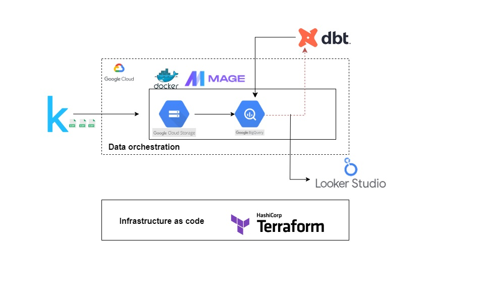

# Football-Data-Analytics
Interactive Dashboard for Football Kaggle dataset from Transfermarkt.

## Data is extracted from Kaggle
 - https://www.kaggle.com/datasets/davidcariboo/player-scores

What does it contain?
The dataset is composed of multiple CSV files with information on competitions, games, clubs, players and appearances that is automatically updated once a week. Each file contains the attributes of the entity and the IDs that can be used to join them together.

### What's case about? (Problem description)
- providing analytics and statistics on all players during the tournaments, along with comprehensive statistics on European players' performance. This includes analyzing their goals, assists, and other relevant metrics. By examining the data, managers can gain insights into the performance of European players and make informed decisions when scouting for talent to join the top five leagues, such as the Premier League.


### Technology Stack

- **Terraform** (Infrastructure as Code)
    - **Deployment**: Used to deploy all the needed resources on GCP. 

- **Docker**
    - **Containerization**: running mage on docker using compose up command to run in container.

- **Google Cloud Platform** (GCP)
    - **Google Cloud Storage (Datalake)**: Where data lands from the bash script that we run on Google Cloud VM
    - **BigQuery (Datawarehouse)**: Where data is stored in dimensional modeling.

- **Mage**
    - **Orchestration Tool**: Used for our data pipeline flow.

- **DBT** (Data Build Tool)
    - **Reporting Layer**: Built in models.

- **Looker Data Studio** 
    - **Dashboard**: - [Google Looker Studio](https://lookerstudio.google.com/reporting/c35d78dd-2bdb-4e86-a8b9-dff903235ddd).
    


### Data Pipeline Flow



As shown in image our data flow consists of below section:

**1. Deploying Gcp Resources using Terraform IAC**
**2. Data Ingestion**:
- Landing the raw data which fetched using Kaggle API token into google cloud storage into 9 csv format files using the download from kaggle to gcs bash script to land it directly to gcs  .
    1. running cloud vm 
        
    2. create-kaggle-api-token from account settings > API > Create New Token > this downloads a `kaggle.json` file
        
    3. download the bash script `download_from_kaggle.sh` from the project repo
    4. upload the script and the token to the vm shell directly 
        
    5. executing the ingestion script on vm using the command
     ```bash #run this command into you vm cloud bash
    ./download_from_kaggle.sh [DATASET] [Your-GCP-Project-ID]
    # permission giving 
    chmod +x download_from_kaggle.sh
    ```
        
    6. files ingested into bucket
        


**3. Data orchestration**:
- setting up mage instance:
    ```bash
    git clone https://github.com/mage-ai/mage-zoomcamp.git mage-zoomcamp
    ```
- Navigate to the repo:
    ```bash
    cd mage-data-engineering-zoomcamp
    ```
- Rename dev.env to simply .env— this will ensure the file is not committed to Git by accident, since it will contain credentials in the future.

- Now, let's build the container
    ```bash
    docker compose build
    ```
- Now, navigate to http://localhost:6789 in your browser! Voila! You're ready to get started with Mage.

- create our pipelines: (from GCS, transforming, to Biquery dataset )

    - just because of kernel crashes, our project contains two pipelines :

    1. appearances data which holds over 1.5 million records 
        

    2. other tables pipeline: 

        

**4. Datawarehouse schema**:

- managed to create the dwh schema of the facts and dims tables:
    
 


## 5. DBT transformations

In this step, we initiate our dbt project to create the required transformations and views. We are using Google BigQuery as our data warehouse.

### Prerequisites

- Make sure you have dbt installed. If not, you can install it using pip: `pip install dbt` or use the dbt cloud IDE.
- You need to have a Google Cloud Platform (GCP) account and access to a BigQuery dataset.

### Setup

1. **Create a dbt profile**: dbt uses profiles to manage connection settings to your data warehouse. Create a `profiles.yml` file in your dbt directory (usually `~/.dbt/`) and provide the necessary details. Here's an example for a BigQuery setup:

```yaml
your-profile:
  target: dev
  outputs:
    dev:
      type: bigquery
      method: service-account
      project: your-gcp-project
      dataset: your-dataset
      threads: 1
      timeout_seconds: 300
      location: US
      keyfile: /path/to/service-account.json
```
Replace `your-profile`, `your-gcp-project`, `your-dataset`, and `/path/to/service-account.json` with your actual profile name, GCP project ID, dataset, and service account key file path.

2. Initialize a dbt project: Navigate to the directory where you want to create your dbt project and run: `dbt init your-dbt-project`. Replace `your-dbt-project` with the name you want to give to your dbt project.

3. Build your dbt project: A dbt project consists of models (SQL files), tests, snapshots, macros, and more. You'll create these in the respective directories within your dbt project.

4. Run your dbt project: Once you've set up your models and other components, you can run your dbt project with: `dbt run`. This command compiles your dbt models to SQL and runs them against your BigQuery dataset.

Remember to navigate to your dbt project directory before running the `dbt run` command.


4. **Dashboarding:**
    - create a data source on looker studio using the resulting data from DBT model on Bigquery
    - Check out the dashboards below:
    - **Player Performance Analysis** 
    - https://lookerstudio.google.com/reporting/c35d78dd-2bdb-4e86-a8b9-dff903235ddd
    - Dashboard showing the Performance stats of players such as Goals, Assists, Market Value and more.
    
    - screenshot of the dashboard:
        